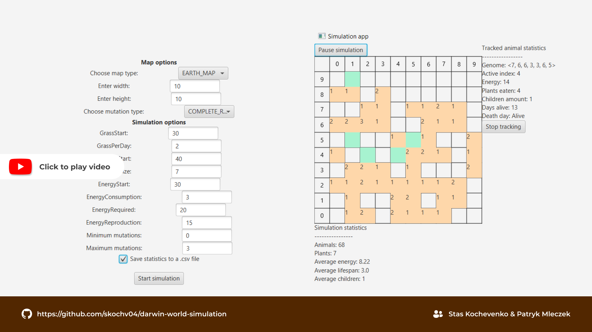

# 🧬 Darwin World Simulation

A JavaFX project, developed as part of the 3th semester of studies at AGH.

## 👥 Team Members:
- **Stas Kochevenko**  
- **Patryk Mleczek**

## 🌍 Simulation Overview:

Darwin World Simulation is a 2D ecosystem simulation, where an evolving world unfolds before your eyes. The environment consists of steppes and jungles, populated by herbivorous animals that roam, forage, eat, and reproduce.

### World Features:

- Grid-based map with jungle and steppe biomes  
- Dynamic plant growth (faster in jungles, slower in steppes)  
- Animal energy system (losing energy daily, gaining it by eating plants)  
- Natural selection mechanics (starvation leads to death)  
- Genetic evolution (mutations, inheritance, and behavioral variations)  
- Configurable simulation parameters (map size, plant growth, energy levels, mutation rates, etc.)  

Built with **Java** and **JavaFX**, this project models Darwinian evolution in an interactive way.

## 🛠️ Technologies Used:
- **Programming Language**: Java ☕  
- **Framework**: JavaFX 🎨  
   
[](https://youtu.be/5V80xosqOaE)

## 🚀 How to Run the simulation?
### 1️⃣ Clone the Repository
```bash
git clone https://github.com/skochv04/darwin-world-simulation  
cd repository
```
### 2️⃣ Install Java and JavaFX (if not already installed)

### 3️⃣ Execute the main class
